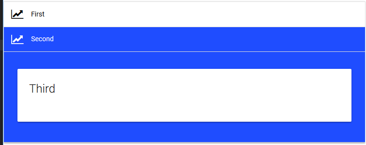

# Collapsible

Collapsibles allow you to group and hide different controls. Users can click to expand the collapsible items. 

## Basic Collapsible


```powershell
New-UDCollapsible -Items {
    New-UDCollapsibleItem -Id "First" -Title "First" -Icon user -Content {
        New-UDCard -Title "First"
    } -Active
    New-UDCollapsibleItem -Id "Second" -Title "Second" -Icon group -Content {
        New-UDCard -Title "Second"
    }
    New-UDCollapsibleItem -Id "Third" -Title "Third" -Icon user -Content {
        New-UDCard -Title "Third"
    }
}
```

## Dynamic Content 



You can use an Endpoint to specify dynamic content for your collapsible items. 

```powershell
New-UDCollapsible -Items {
    New-UDCollapsibleItem -Title "First" -Icon line_chart -Endpoint {
        New-UDCard -Title "Endpoint"
    } -Active

    New-UDCollapsibleItem -Title "Second" -BackgroundColor "#1F4DFF" -FontColor "white" -Icon line_chart -Content  {
        New-UDCard -Title "Third"
    } 
}

```
